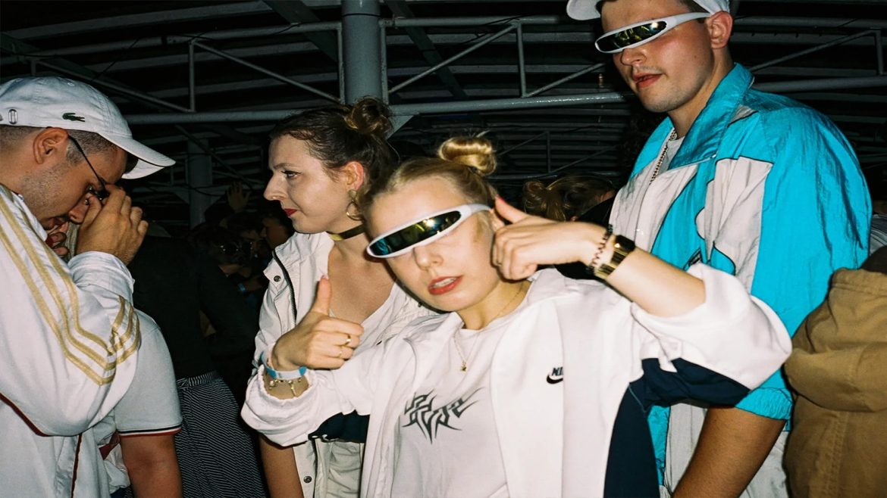

# 9ladies

Batch image description CLI using Vision Language Models via [Ollama](https://ollama.com/).

Named after the [Nine Ladies](https://en.wikipedia.org/wiki/Nine_Ladies) stone circle in Derbyshire.

## Example



```bash
$ echo "tests/fixtures/gabber.jpg" | 9ladies \
    --prompt 9ladies/prompts/describe.json \
    --url http://localhost:11434 \
    --model llava:13b
```

```json
{"file":"tests/fixtures/gabber.jpg","response":"The image depicts a lively scene at an indoor event, possibly a concert or party. There are several individuals visible, all appearing to be enjoying themselves. A woman is prominently featured in the foreground, wearing sunglasses and making a peace sign with her hand. She seems to be having a good time, possibly dancing or singing along to music."}
```

## Installation

```bash
# Build from source
cargo build --release

# Binary at target/release/9ladies
```

Requires [Ollama](https://ollama.com/) with a vision model:

```bash
ollama pull llava:13b        # 8 GB, good balance
ollama pull qwen2.5vl:32b    # 21 GB, higher quality
```

## Usage

```bash
# Describe images
ls photos/*.jpg | 9ladies --prompt prompts/describe.json --url http://localhost:11434 --model llava:13b

# Count people (structured JSON output)
find ./events -name "*.png" | 9ladies --prompt prompts/people-count.json --url http://localhost:11434 --model llava:13b

# Validate without calling model
ls *.jpg | 9ladies --prompt prompts/describe.json --url http://localhost:11434 --model llava:13b --dry-run
```

## CLI Arguments

| Argument | Required | Description |
|----------|----------|-------------|
| `--prompt <file>` | Yes | Path to prompt configuration JSON |
| `--url <url>` | Yes | Ollama server URL (default: `http://localhost:11434`) |
| `--model <name>` | Yes* | Vision model name (e.g. `llava:13b`) |
| `--dry-run` | No | Validate inputs without calling the model |

*Model can also be set in the prompt config file.

## Prompt File Format

```json
{
  "system": "You are an image analysis assistant.",
  "prompt": "Describe this image in detail.",
  "temperature": 0.3,
  "model": "llava:13b"
}
```

See `9ladies/prompts/` for examples:
- `describe.json` — general image description
- `people-count.json` — count people, returns structured JSON
- `barcode-finder.json` — detect barcodes and ingredients lists

## Output

JSONL to stdout, one object per line:

```json
{"file": "path/to/image.jpg", "response": "Description text or JSON object"}
```

Errors go to stderr; processing continues on individual file failures.

## Supported Formats

JPEG, PNG, WebP, GIF — detected by file content (magic bytes), not extension.
